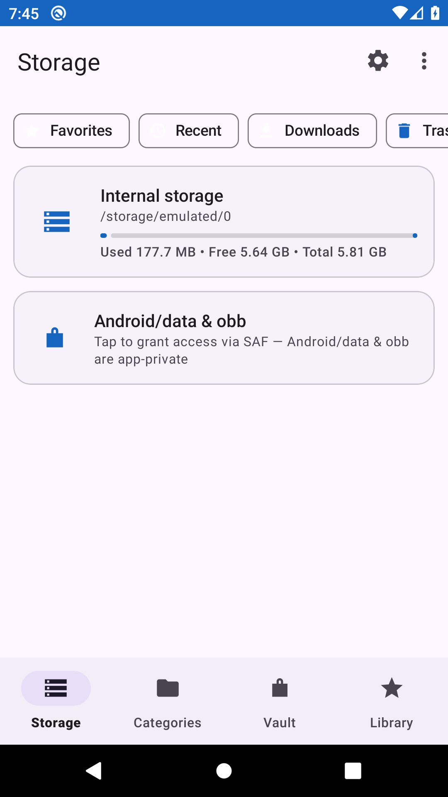
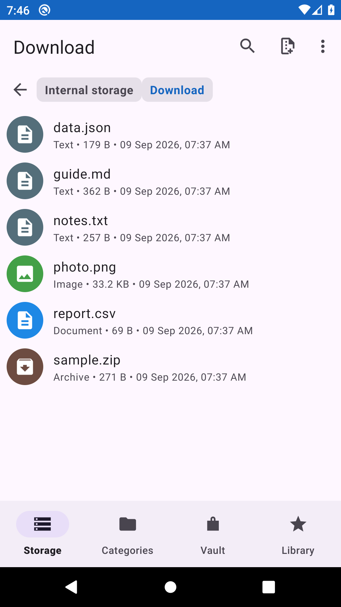
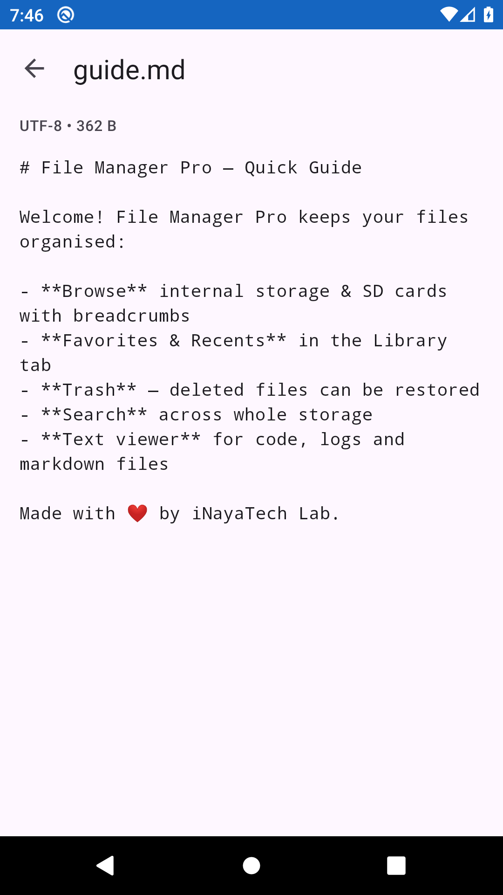
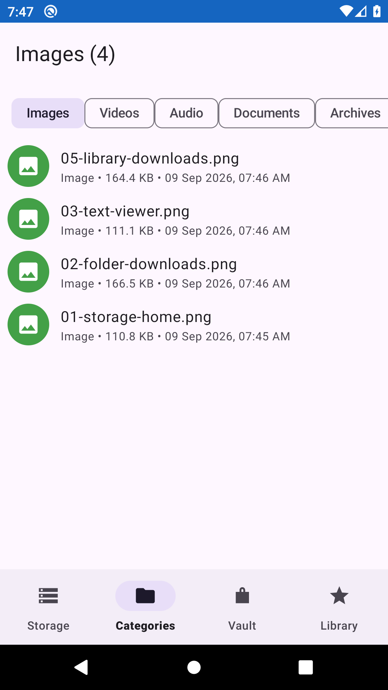
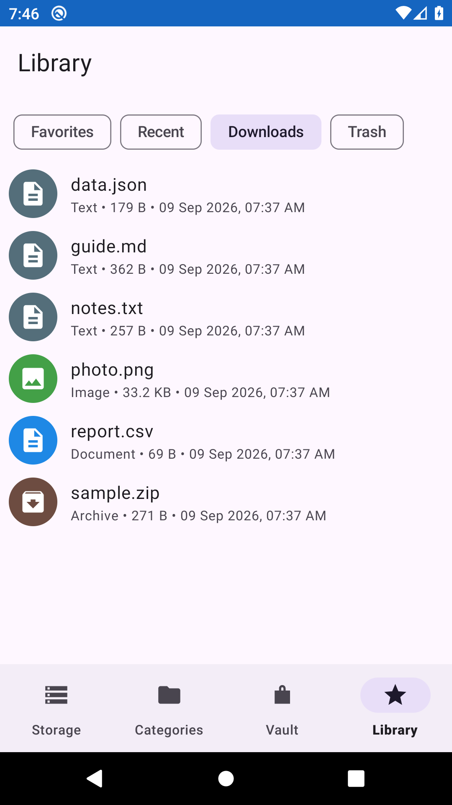
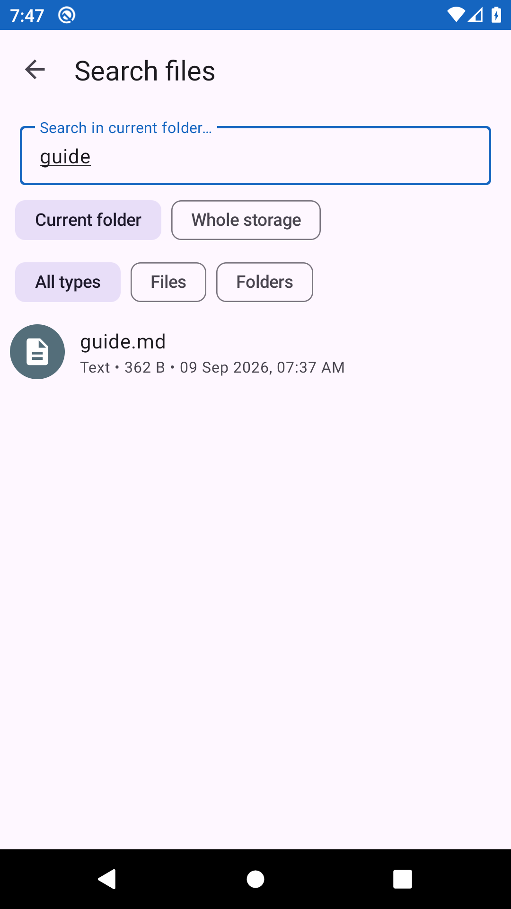
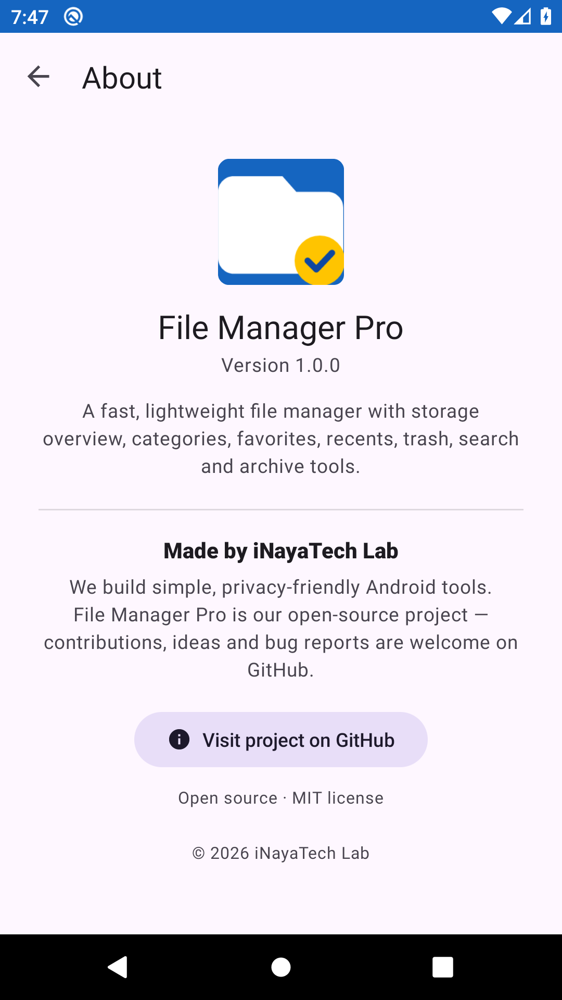

# File Manager Pro

**A modern Android file manager** built with Kotlin + Material Design 3,
crafted and maintained by **iNayaTech Lab** — a software lab focused on
practical, privacy-friendly Android tooling.

Browse internal storage & SD cards, view media by category, search,
copy / move / rename / delete / compress / extract, read text files and
jump straight back to your favorites and recent files — all with an
intuitive selection-mode workflow and full Bangla (বাংলা) localization.

---

## 📸 Screenshots

Real screenshots captured from the app running on an Android 10 (API 29)
emulator as part of the project's CI pipeline — no mockups.

| | |
| --- | --- |
|  |  |
| **Storage home** — quick-access chips + volume cards | **Folder browsing** — Downloads folder (list view) |
|  |  |
| **Text viewer** — read text/markdown right inside the app | **Categories** — images, videos, audio, documents & more |
|  |  |
| **Library** — Favorites, Recents & Downloads quick access | **Search** — live incremental file search |
|  |
| **About** — company information, version & open-source links |

---

## ✨ Features

| Area | What you can do |
| --- | --- |
| 🗂 Browse | Folder navigation with clickable breadcrumbs + up button, list ⇄ grid views, pull-to-refresh, folders always listed first |
| 🧠 Sorting | Sort by name / date / size / type, ascending ⇄ descending (persisted) |
| 📋 Multi-select | Long-press to select, select all, contextual action bar |
| 🔁 File ops | Copy, move (cut + paste), rename, delete (with confirm), paste-safety checks |
| 📦 Archives | Compress selection to `.zip`, extract `.zip` (with zip-slip protection) |
| 🖼 Categories | Images / Videos / Audio via MediaStore; Documents / Archives / APKs via filesystem scan |
| 🔍 Search | Live incremental search of the current folder tree (up to 4000 results) |
| 📄 Text viewer | In-app reader for text & markdown files, with automatic encoding detection |
| 📚 Library | Favorites, Recents and Downloads quick-access chips for one-tap opening |
| 👁 Preview | Swipeable full-screen image viewer; other types open with external apps |
| 📤 Share / Info | Share any selection; detailed properties dialog (folder sizes included) |
| 🌐 Storage | Internal storage + removable volumes (needs "All files access") |
| 💼 About | Company page with version, license and GitHub link |
| 🈶 Localization | English + Bangla (values-bn) |

## 🛠 Tech stack

- **Language:** Kotlin 1.9 — **UI:** Views + ViewBinding, Material 3 (1.12)
- **Min / Target SDK:** 26 / 34 — **Architecture:** single-Activity + Fragments
- **Images:** Coil 2 — **Concurrency:** Coroutines — **Extras:** ViewPager2, SwipeRefreshLayout, FileProvider

## 📁 Project structure

```
app/src/main/java/com/inayatechlab/filemanagerpro/
├── MainActivity.kt            # Host activity: toolbar, crumbs, bottom nav, tab switching
├── browse/                    # Folder browsing (BrowseFragment), list/grid FileAdapter,
│                              # breadcrumb CrumbAdapter, SortDialog
├── library/                   # Library tab: Favorites / Recents / Downloads + trash screen
├── textviewer/                # In-app TextActivity for text & markdown files
├── categories/                # Category chips + MediaStore/filesystem scans
├── search/                    # SearchActivity + recursive Scanner
├── preview/                   # Swipeable image PreviewActivity + pager
├── settings/                  # Settings + AboutActivity (company info)
├── ops/FileOps.kt             # Copy/move/delete/rename/zip/unzip engine (IO-safe)
├── util/                      # FileCat, StorageUtils, FormatUtils, OpenUtils, Icons, Dialogs, Scanner
└── model/FileEntry.kt         # Data model + in-process clipboard
```

## 🚀 Building

Requirements: **Android Studio** (or JDK 17 + Android SDK), Android SDK Platform 34.

```bash
# Terminal / Android Studio:
./gradlew assembleDebug          # macOS / Linux
gradlew.bat assembleDebug        # Windows
```

Debug APK output: `app/build/outputs/apk/debug/app-debug.apk`

> First build downloads Gradle 8.7 and dependencies automatically.

### In Android Studio
1. `File ▸ Open…` → select the project folder.
2. Wait for Gradle sync, then `Run ▸ 'app'` (⇧F10) with a device/emulator.

## 🔐 Permissions

The app is a file manager, so on **Android 11+** it requires
**"All files access"** (`MANAGE_EXTERNAL_STORAGE`) which the user grants from
the system screen — on Android 10 and below the app requests the legacy
external-storage runtime permissions instead. On first launch the app guides
you through this.

## 🧭 Roadmap

See **[docs/ROADMAP.md](docs/ROADMAP.md)** for the full milestone plan
(M1 foundation → M4 stable 1.0.0). GitHub Milestones & issues track each item;
every merge to `main` produces an automatically versioned, signed **prerelease** APK.

## 🏢 About iNayaTech Lab

**File Manager Pro** is developed by **iNayaTech Lab**, a software lab building
practical Android applications with a focus on clean UX and open tooling.
This project is open source — explore the code, report issues, or contribute
on GitHub: [github.com/iNAYATechLab](https://github.com/iNAYATechLab)
(project: [File-Manager-Pro](https://github.com/iNAYATechLab/File-Manager-Pro)).

## 📜 License

[MIT](LICENSE) © 2026 iNAYATechLab
